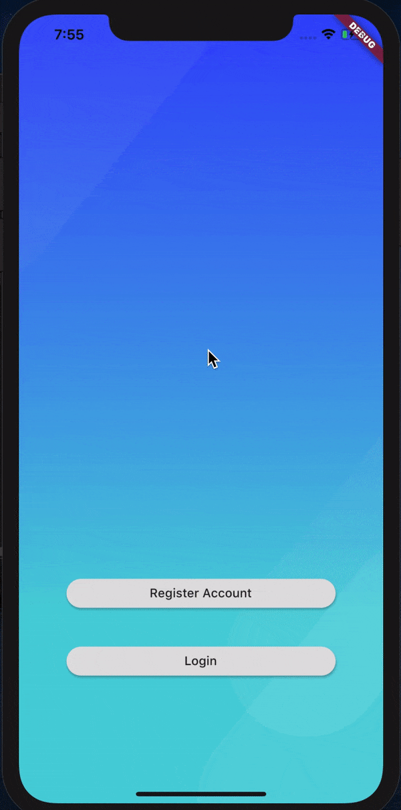

# abersoft_test

Abersoft Test Skill of Flutter App

## Getting Started

If you can't login on this project, its mean you don't have access to firebase auth because we have to register SHA-1 of our computer to Firebase.

### Login

Register using random email and password

### Logout

In the  Home Page, Tap the image and you will go again to welcome screen and it's will be destroy your session.

### Library

 **cupertino_icons: ^0.1.3**
 
 This lib for use ios icons
 
 **provider: ^4.3.2+2**
 
 This lib is For State management
 
 **firebase_auth: ^0.18.0+1**
 
 This is for authentification
 
 **firebase_core: ^0.5.0**
 
 when you want to use firebase, you must add this library
 